# 🏗️ ARCHITECTURE — Royal Air Maroc Airline System (CabineIQ)

> **Last updated:** June 2026 &nbsp;|&nbsp; **Status:** Active development

---

## Table of Contents

1. [Overview](#1-overview)
2. [System Architecture Diagram](#2-system-architecture-diagram)
3. [Repository Layout](#3-repository-layout)
4. [Backend Architecture](#4-backend-architecture)
5. [Frontend Architecture — `frontend-new`](#5-frontend-architecture--frontend-new)
6. [End-to-End Data Flows](#6-end-to-end-data-flows)
7. [Configuration & Environment](#7-configuration--environment)
8. [Local Development](#8-local-development)
9. [Design Notes & Known Constraints](#9-design-notes--known-constraints)

---

## 1. Overview

| | |
|---|---|
| **Project** | Royal Air Maroc Airline System — *CabineIQ* |
| **Purpose** | Internal airline operations platform: flights, aircraft, seats, passengers, feedback analytics, AI copilot, notifications |
| **Backend** | Java 21 · Spring Boot 3.2 · Spring Cloud 2023 (Microservices) |
| **ML Service** | Python Flask · XGBoost · scikit-learn |
| **Frontend** | React 19 · TypeScript · Vite 8 · Tailwind CSS |
| **Database** | MySQL 8 (database-per-service pattern) |
| **Discovery** | Netflix Eureka |
| **Entry Point** | API Gateway → port `8080` |

---

## 2. System Architecture Diagram

### 2.1 High-Level System Topology

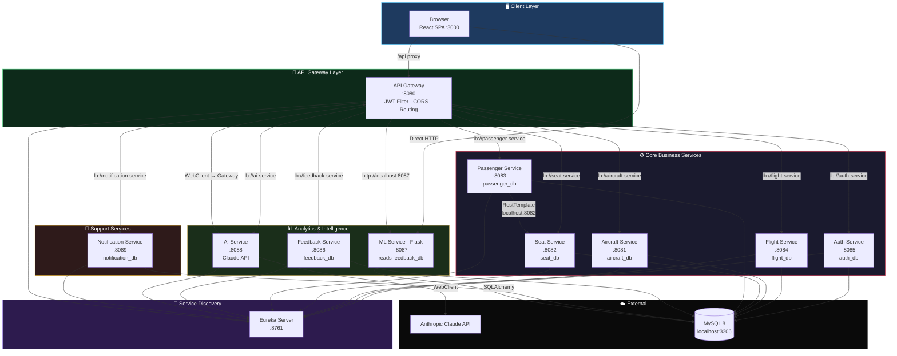

### 2.2 Gateway Routing Map

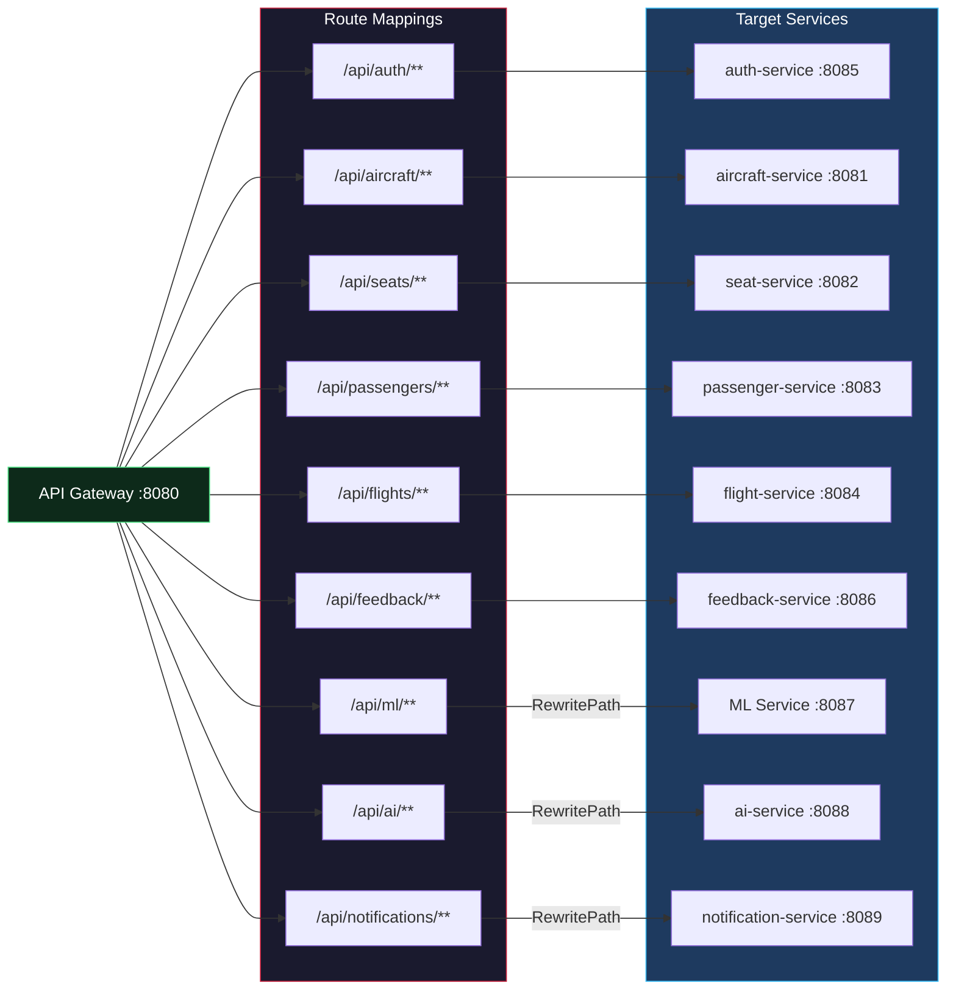

---

## 3. Repository Layout

```
airline-system/
├── backend/                          # Maven multi-module microservices
│   ├── pom.xml                       # Parent POM
│   ├── discovery-service/            # Eureka Server
│   ├── api-gateway/                  # Spring Cloud Gateway + JWT filter
│   ├── auth-service/                 # Authentication & JWT issuance
│   ├── aircraft-service/             # Aircraft CRUD
│   ├── seat-service/                 # Seat map generation & status
│   ├── passenger-service/            # Passenger CRUD & seat assignment
│   ├── flight-service/               # Flight CRUD & status management
│   ├── feedback-service/             # Passenger feedback & analytics
│   ├── ai-service/                   # Claude-powered AI copilot
│   ├── notification-service/         # In-app notifications
│   └── ml-service/                   # Python Flask (NOT in Maven parent)
│       ├── app.py                    # Flask API server (:8087)
│       ├── train.py                  # XGBoost nightly training
│       └── requirements.txt
├── frontend-new/                     # React SPA — CabineIQ UI
│   ├── src/
│   │   ├── App.tsx                   # Router + QueryClientProvider
│   │   ├── lib/api.ts                # Axios clients + 9 API modules
│   │   ├── hooks/                    # useAuth, useTheme
│   │   ├── types/index.ts            # Shared TypeScript interfaces
│   │   ├── data/airports.ts          # Static coords for 3D globe
│   │   ├── pages/                    # 9 route-level screens
│   │   └── components/               # 8 feature directories
│   └── vite.config.ts
├── start.bat                         # Orchestrates all services
└── stop.bat                          # Kills all services
```

### 3.1 Component Dependency Graph

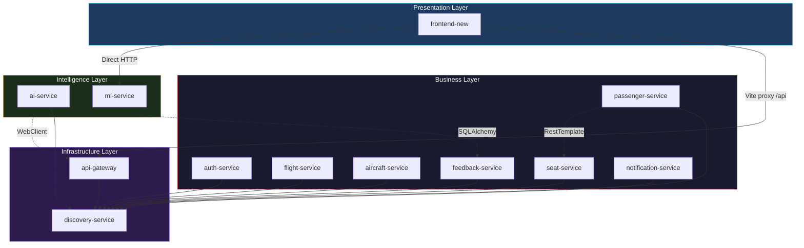

---

## 4. Backend Architecture

**Pattern:** Microservices with database-per-service, Eureka service discovery, and a single Spring Cloud API Gateway.

### 4.1 Service Registry

| Service | Port | Database | Spring Boot App | Responsibility |
|---------|------|----------|-----------------|----------------|
| Discovery (Eureka) | `8761` | — | `DiscoveryServiceApplication` | Service registry & health dashboard |
| API Gateway | `8080` | — | `ApiGatewayApplication` | Routing, JWT enforcement, CORS, path rewriting |
| Auth | `8085` | `auth_db` | `AuthServiceApplication` | Register, login, JWT issuance (HMAC-SHA) |
| Aircraft | `8081` | `aircraft_db` | `AircraftServiceApplication` | Aircraft CRUD, status tracking |
| Seat | `8082` | `seat_db` | `SeatServiceApplication` | Seat map generation, seat status management |
| Passenger | `8083` | `passenger_db` | `PassengerServiceApplication` | Passenger CRUD, seat assignment (cross-service) |
| Flight | `8084` | `flight_db` | `FlightServiceApplication` | Flight CRUD, status transitions |
| Feedback | `8086` | `feedback_db` | `FeedbackServiceApplication` | Passenger feedback intake & analytics aggregation |
| AI | `8088` | — | `AiServiceApplication` | Claude-powered NL query → internal API calls |
| Notification | `8089` | `notification_db` | `NotificationServiceApplication` | In-app notification CRUD & read tracking |
| ML (Flask) | `8087` | reads `feedback_db` | `app.py` | Sentiment/intent predictions, XGBoost training |

### 4.2 Per-Service Internal Architecture

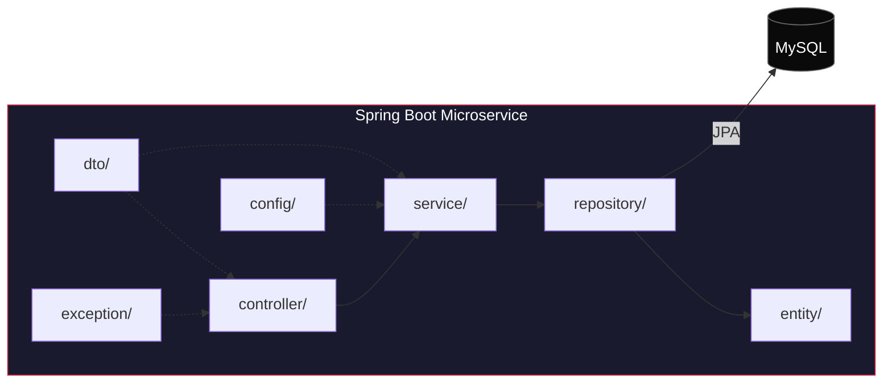

**Standard layers per service:**
`controller/` → `service/` → `repository/` → `entity/` + `dto/`, optional `config/`, `exception/`

### 4.3 Authentication & Authorization Flow

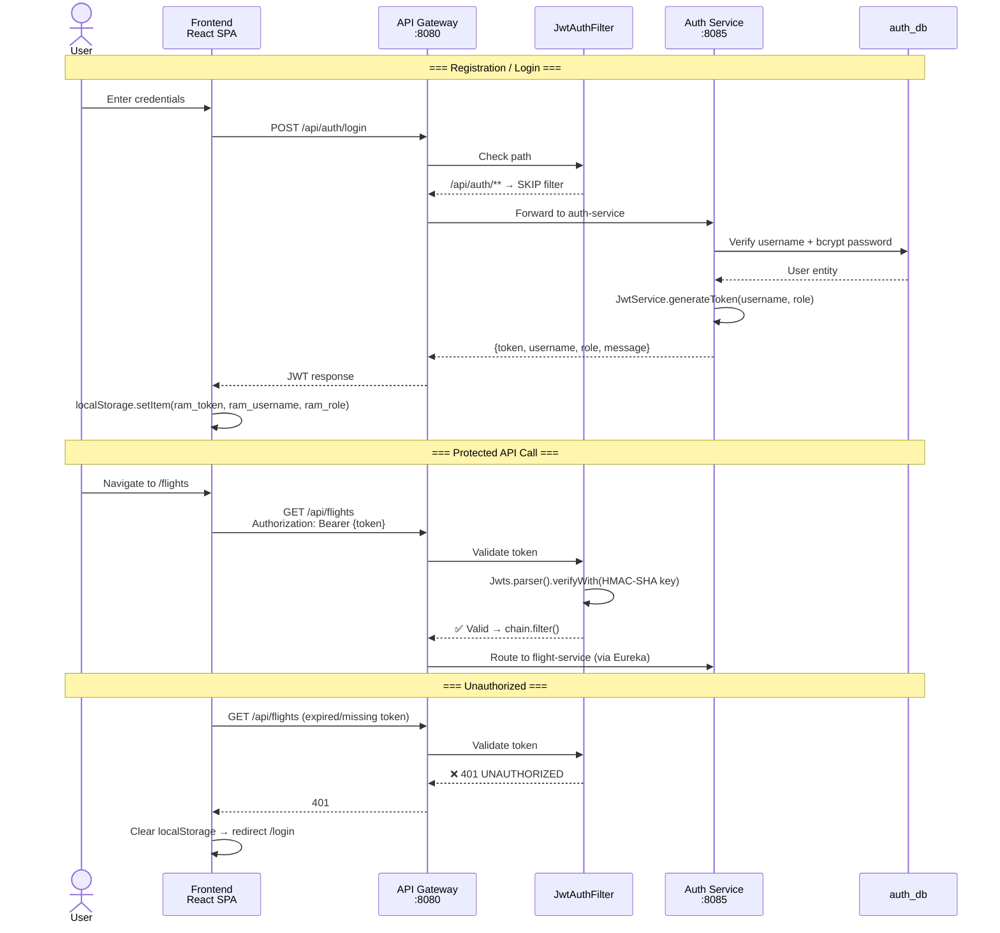

### 4.4 Inter-Service Communication

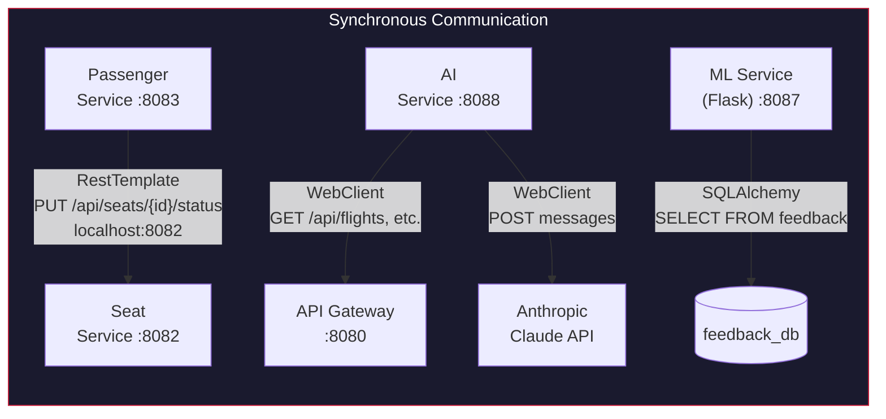

### 4.5 Database-Per-Service Schema

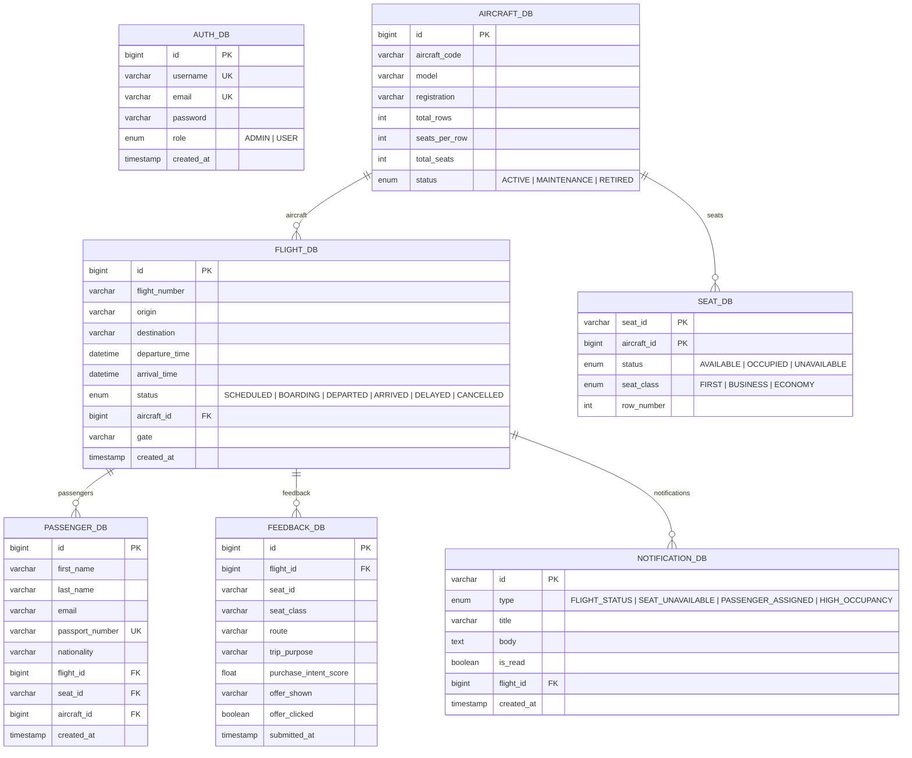

---

## 5. Frontend Architecture — `frontend-new`

**App name:** CabineIQ — Royal Air Maroc operations UI

### 5.1 Tech Stack

| Layer | Technology | Version |
|-------|------------|---------|
| UI Framework | React + TypeScript | 19.x |
| Build Tool | Vite | 8.x |
| Dev Server Port | — | `:3000` |
| Routing | React Router | v7 (nested) |
| Server State | TanStack React Query | v5 |
| HTTP Client | Axios | latest |
| Styling | Tailwind CSS + Radix UI | 3.x |
| 3D Globe | react-globe.gl | latest |
| Charts | Recharts | latest |
| Icons | react-icons (Tabler) + @tabler/icons-react | latest |

### 5.2 Component Architecture

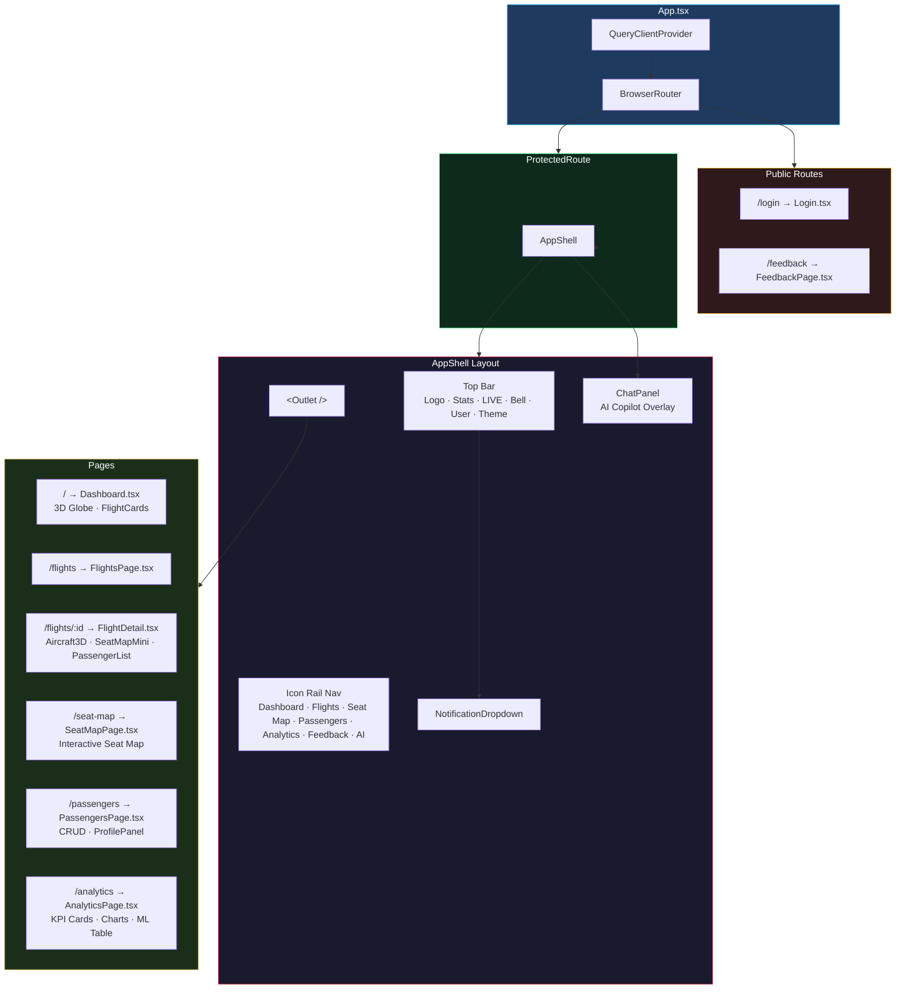

### 5.3 Frontend Routing Table

| Path | Component | Access | Description |
|------|-----------|--------|-------------|
| `/login` | `Login.tsx` | 🌐 Public | Username/password → JWT auth |
| `/feedback` | `FeedbackPage.tsx` | 🌐 Public | Passenger feedback survey form |
| `/` | `Dashboard.tsx` | 🔒 Protected | 3D globe with flight arcs, FlightCards, HoverPanel |
| `/flights` | `FlightsPage.tsx` | 🔒 Protected | Flight list with status badges |
| `/flights/:id` | `FlightDetail.tsx` | 🔒 Protected | Aircraft3D model, SeatMapMini, passenger list, QR, status changer |
| `/seat-map` | `SeatMapPage.tsx` | 🔒 Protected | Full interactive seat map per aircraft |
| `/passengers` | `PassengersPage.tsx` | 🔒 Protected | Passenger CRUD, search, seat assignment, profile panel |
| `/analytics` | `AnalyticsPage.tsx` | 🔒 Protected | KPI cards, 4 Recharts, ML predictions table |
| `*` | `NotFound.tsx` | 🌐 Public | 404 fallback |

### 5.4 State Management Architecture

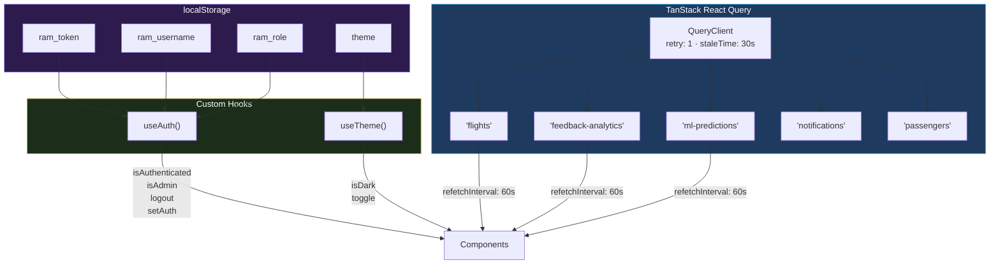

### 5.5 API Integration Layer

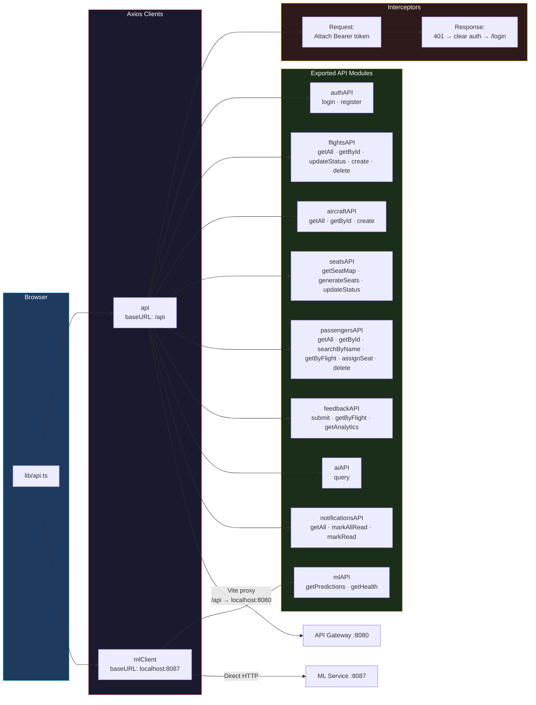

---

## 6. End-to-End Data Flows

### 6.1 Login & Protected Access

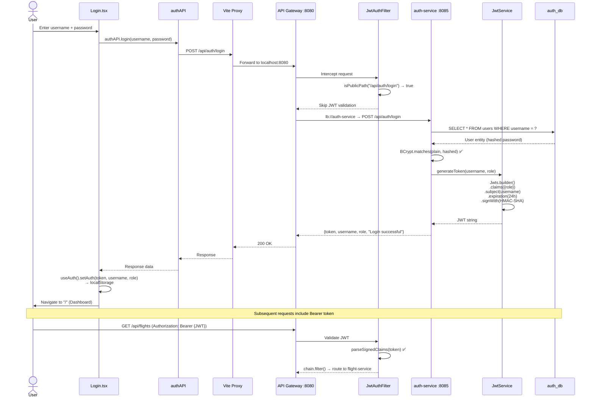

### 6.2 Seat Assignment (Cross-Service)

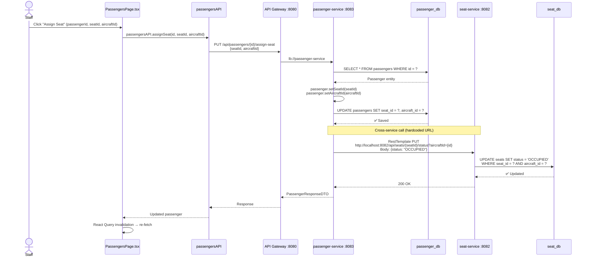

### 6.3 AI Copilot Query

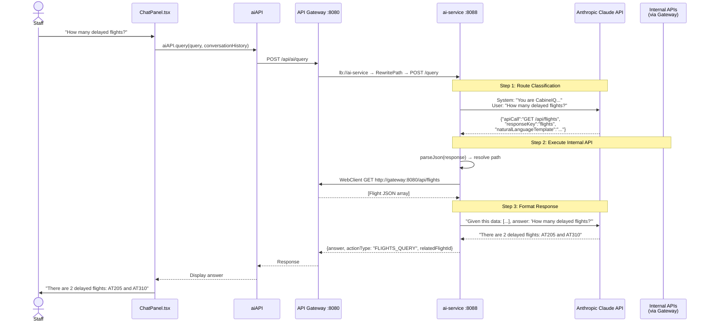

### 6.4 ML Predictions Pipeline

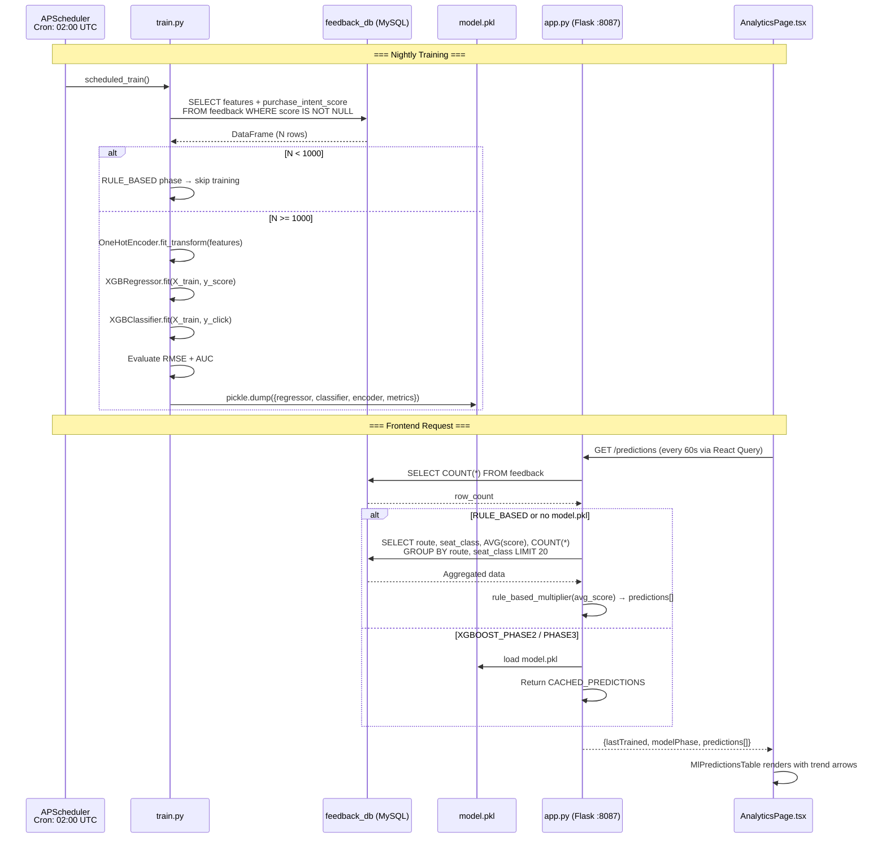

### 6.5 Notification Flow

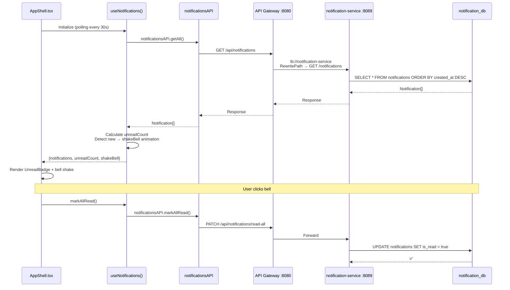

---

## 7. Configuration & Environment

### 7.1 Environment Variables

| Variable | Used by | Purpose | Default |
|----------|---------|---------|---------|
| `JWT_SECRET` | API Gateway, auth-service | Shared HMAC-SHA signing key | Hardcoded hex fallback |
| `ANTHROPIC_API_KEY` | ai-service | Claude API authentication | *(empty — service returns "unavailable")* |
| `DB_HOST` | ml-service | MySQL host | `localhost` |
| `DB_PORT` | ml-service | MySQL port | `3306` |
| `DB_NAME` | ml-service | MySQL database name | `feedback_db` |
| `DB_USER` | ml-service | MySQL username | `root` |
| `DB_PASS` | ml-service | MySQL password | `root` |

### 7.2 CORS Configuration

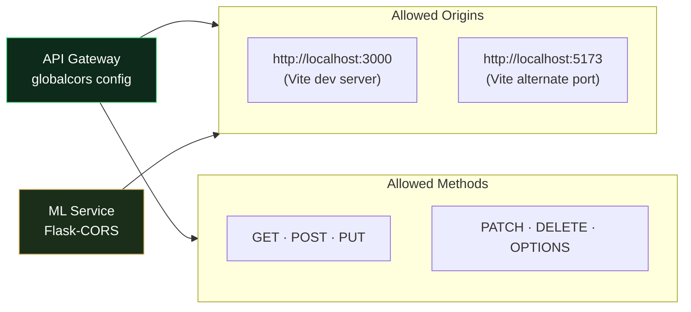

### 7.3 Database Configuration

All Spring Boot services share this pattern:
```yaml
spring:
  datasource:
    url: jdbc:mysql://localhost:3306/{service_db}
    username: root
    password: root
  jpa:
    hibernate:
      ddl-auto: update    # Auto-schema, no migrations
    show-sql: true
```

---

## 8. Local Development

### 8.1 Prerequisites

| Tool | Version |
|------|---------|
| Java | 21+ |
| Maven | 3.9+ |
| Node.js | 18+ |
| Python | 3.10+ |
| MySQL | 8.0+ |

### 8.2 Startup Sequence

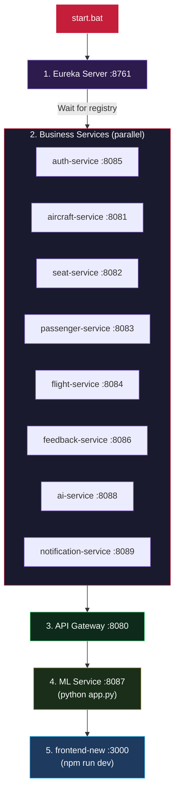

### 8.3 Key URLs

| Resource | URL |
|----------|-----|
| 🖥️ Frontend (CabineIQ) | http://localhost:3000 |
| 🔐 API Gateway | http://localhost:8080 |
| 📡 Eureka Dashboard | http://localhost:8761 |
| 🤖 ML Health Check | http://localhost:8087/health |
| 📊 ML Predictions | http://localhost:8087/predictions |

---

## 9. Design Notes & Known Constraints

### 9.1 Security

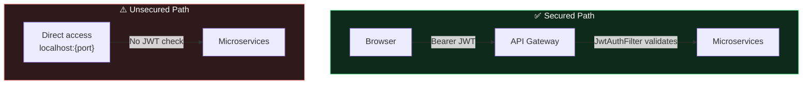

- **JWT enforced only at the gateway.** Individual services on their direct ports do not validate tokens.
- JWT is HMAC-SHA signed with a shared `JWT_SECRET` between `auth-service` and `api-gateway`.
- Public paths: `/api/auth/login`, `/api/auth/register` skip JWT validation.

### 9.2 Data Layer

- **No migration tooling** — all services use Hibernate `ddl-auto: update` for schema management. No Flyway or Liquibase.
- **Database-per-service** — each service owns its schema, but cross-database joins are not possible.

### 9.3 Inter-Service Coupling

- **Passenger → Seat** uses hardcoded `http://localhost:8082` instead of Eureka discovery (`lb://seat-service`).
- **ML → MySQL** reads `feedback_db` directly via SQLAlchemy — bypasses the feedback-service API entirely.

### 9.4 ML Service Integration

- Frontend makes **direct HTTP calls** to `localhost:8087` for `/predictions` and `/health`.
- Gateway also routes `/api/ml/**` to `localhost:8087` with path rewriting.
- Dual integration path creates redundancy.

### 9.5 Other Constraints

- **AI service** requires `ANTHROPIC_API_KEY` or returns "AI service is temporarily unavailable."
- **Public feedback page** (`/feedback`) submits data via `feedbackAPI.submit()` to the gateway.
- **No WebSocket/SSE** — notification polling uses React Query interval-based refetching.
- **No container orchestration** — local development only via `start.bat`/`stop.bat`.
